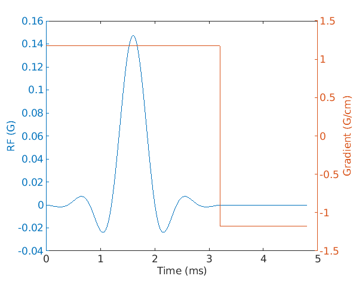
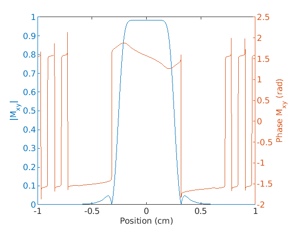
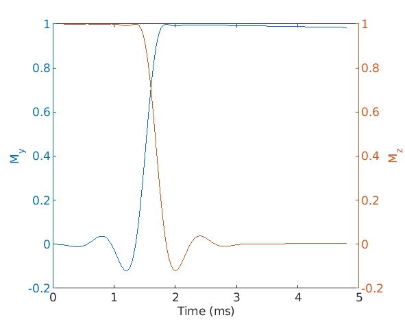
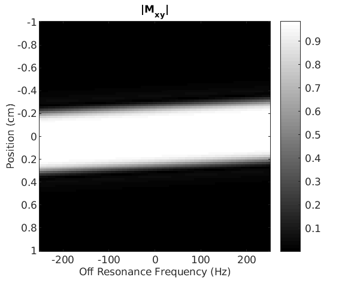

# Bloch Equation Simulator

## Synopsis
A Bloch equation simulator, written by 
[Professor Brian A. Hargreaves](mailto:bah@stanford.edu) in 2003, that runs in 
[MATLAB](www.mathworks.com). For speed it is written in C as a MEX function. 
Previously freely shared on his, now unavailable, webpage 
http://www-mrsrl.stanford.edu/~brian/blochsim.

## Usage
```
[mx, my, mz] = bloch(b1, gr, tp, t1, t2, df, dp, mode, mx, my, mz)
```

### Required Inputs 
- `b1`: Mx1 RF pulse (G)
- `gr`: Mx1, 2 or 3-dimensional gradient (G/cm)
- `tp`: Mx1 time duration of each b1 and gr point, or 1x1 time step if constant 
for all points (s) 
- `t1`: Longitudinal (T1) relaxation time (s)
- `t2`: Transverse (T2) relaxation time (s)
- `df`: Nx1 array of off-resonance frequencies (Hz)
- `dp`: Px1, 2 or 3 array of spatial positions (cm)
- `mode`: bitmask to set mode:
  - `bit 0`: 
    - `0`: simulate from start or m0
    - `1`: steady-state
  - `bit 1`: 
    - `0`: just record m at end
    - `1`: record m at all time-points


### Optional Inputs
- `mx, my, mz`: PxN arrays of starting magnetisation, where N is the number of
 frequencies and P is the number of spatial positions

### Output
- `mx, my, mz`: PxN arrays of the resulting magnetisation components at each 
position and frequency


## Description
Bloch simulation of rotations due to B1, gradient and off-resonance, including
relaxation effects. At each time point, the rotation matrix and decay matrix 
are calculated. The simulation can model the steady-state if the sequence is 
applied repeatedly, or the magnetisation starting at m0.

## Building the MEX Function
To build the MEX function, in MATLAB, without debug statements:
```matlab
mex bloch.c
```

Alternatively to build the MEX function with debug statements:
```matlab
mex -output bloch_debug CFLAGS='$CFLAGS -DDEBUG' bloch.c
```

## Demonstration
The simulator can be used to model the effect of a hamming-windowed sinc-shaped 
RF pulse and square-shaped gradient waveform on the initial magnetisation as 
shown in the [MATLAB demo](./demo.m) and described below:

1. Define the gyromagnetic ratio:
    ```matlab
    gamma = 2.6753E8; % Proton gyromagnetic ratio (rad s-1 T-1)
    ```

2. Set the relaxation times:
    ```matlab
    t1=1;   % Longitudinal relaxation (s)
    t2=0.2; % Transverse relaxation (s)
    ```

3. Set the parameters of the RF pulse and selected thickness:
    ```matlab
    flip_rf = pi / 2;       % Flip-angle (radians)
    pw_rf = 3.2E-3;         % Duration (s)
    tbw = 8;                % Time-bandwidth product 
    bw_rf = tbw / pw_rf;    % Bandwidth (Hz)
    alpha_rf = 0.46;        % Sinc apodisation 0=none, 0.46=hamming, 0.5=hanning
    n_rf = 800;             % Number of points
    dt = pw_rf / n_rf;      % Time interval (s)
    slthick = 5E-3;         % Slice thickness (m)
    ```

4. Generate the RF pulse: 
    ```matlab
    b1 = msinc(n_rf, tbw / 4, alpha_rf);             % Pulse waveform (unitless)
    a_rf = 10000 * flip_rf / (sum(b1) * dt * gamma); % RF amplitude (G)
    b1 = [a_rf .* b1 zeros(1, n_rf / 2)];            % RF pulse waveform (G)
    ```

    The msinc function is defined as:
    ```matlab
    function ms = msinc(n, m, alpha)
    %  Return a windowed sinc of length n, with m sinc-cycles,
    %  i.e. a time-bandwidth of 4*m, alpha 0=none, 0.46=hamming, 
    %  0.5=hanning sinc apodisation
    %
    %  Originally written by John Pauly, 1992
    %  (c) Board of Trustees, Leland Stanford Junior University
    %
    %  Modified to to include alpha by Stephen Wastling
    
    x = [-n / 2 : (n - 1) / 2] / (n / 2);
    snc = sin(m * 2 * pi * x + 0.00001) ./ (m * 2 * pi * x + 0.00001);
    ms = snc .* ((1 - alpha) + alpha * cos(pi * x));
    ms = ms * 4 * m / n;
    end
    ```

5. Generate the gradient waveform: 
    ```matlab
    a_gz = 100 * 2 * pi * bw_rf / (gamma * slthick); % (G/cm)
    gz=[ones(1, n_rf) -ones(1, n_rf / 2)] .* a_gz;   % Gradient waveform (G/cm)
    g = zeros(n_rf + n_rf / 2, 3);
    g(:, 3) = gz';
    ```
   
6. Plot the RF pulse and gradient waveform:
    ```matlab
   t = [1 : length(b1)] * dt * 1000; % time (ms)

    figure(1);
    yyaxis left
    plot(t, real(b1));
    xlabel('Time (ms)');
    ylabel('RF (G)');
    
    yyaxis right
    plot(t, g(:, 3));
    xlabel('Time (ms)');
    ylabel('Gradient (G/cm)'); 
   ```
   
   
   
7. Simulate the slice profile immediately after the RF pulse and gradient:
    ```matlab
    n_z = 1000; %The number of z-positions to simulate
    z = linspace(-200 .* slthick, 200 .* slthick, n_z);
    r = [zeros(n_z, 1),zeros(n_z, 1), z'];
    f = 0; 
    mode = 0; % Simulation mode: From start, but only record the end timepoint
   
    [mx, my, mz] = bloch(b1, g, dt, t1, t2, f, r, mode);
    mxy = mx + 1i * my;
   
    figure(2);  
    yyaxis left
    plot(z, abs(mxy));
    xlabel('Position (cm)');
    ylabel('|M_{xy}|');
    
    yyaxis right
    plot(z, angle(mxy));
    xlabel('Position (cm)');
    ylabel('Phase M_{xy} (rad)');
    ```

   

8. Simulate the magnetisation over time:
    ```matlab
    r = zeros(1, 3); % Position vector
    f = 0; % Vector of offset frequencies
    mode = 2; % Simulation mode: From start recording all time points
   
    [mx, my, mz] = bloch(b1, g, dt, t1, t2, f, r, mode);
    mxy = mx + 1i * my;
   
    figure(2);  
   
    yyaxis left
    plot(t, my);
    xlabel('Time (ms)');
    ylabel('M_y');
        
    yyaxis right;
    plot(t, mz);
    xlabel('Time (ms)');
    ylabel('M_z');
    ```
   
   
9. Simulate the the slice profile over a range of off-resonance frequencies:
    ```matlab
    n_z = 100; %The number of z-positions to simulate
    z = linspace(-200 .* slthick, 200 .* slthick, n_z);
    r = [zeros(n_z, 1), zeros(n_z, 1), z'];
    n_freq = 100;
    f = linspace(-250, 250, n_freq);
    mode = 0; %Simulation mode: From start, but only record the end timepoint
   
    [mx, my, mz] = bloch(b1, g, dt, t1, t2, f, r, mode);
    mxy = mx + 1i * my;
   
    figure(2);  
    imagesc(f, z, abs(mxy(:,  :)));
    colormap('gray');
    colorbar;
    xlabel('Off Resonance Frequency (Hz)') 
    ylabel('Position (cm)');
    title('|M_{xy}|');
    ```
   
      

## License
The c-code was originally shared by [Professor Brian A. Hargreaves](mailto:bah@stanford.edu) 
on his Stanford webpage http://www-mrsrl.stanford.edu/~brian/blochsim.

This modified version is shared under an [MIT license](./LICENSE).

## Authors and Acknowledgements
Written by [Professor Brian A. Hargreaves](mailto:bah@stanford.edu). Modified 
to build in [MATLAB](www.mathworks.com) R2022a by 
[Dr Stephen Wastling](mailto:stephen.wastling@nhs.net).
